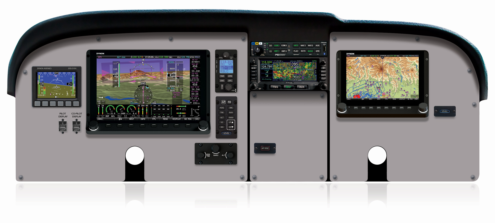

## Dynon Internship
  
Image provided by [dynonavionics.com](dynonavionics.com)  

I interned with Dynon Avionics from January through March 2022. During my time there, I developed and tested new features for the SkyView HDX displays, resolved issues for multiple releases, and helped with final testing of features for release.

### USB Boot
I restructured embedded Linux boot process to allow a SkyView display to boot from a USB stick instead of its internal memory. This included: configuring command line parameters correctly based on which memory we were using; recognizing whether the image the display was booting from was a USB or not; mounting USB and internal partitions were mounted correctly; logging the mounting process to a temporary location, then restarting logging in a permanent location; and making sure the file system expansion happened at the correct time.  

### Expanded Ethernet Configuration
I reconfigured network for Gigabit Ethernet and expanded the UI to expose network speed and other setup. Before I worked on this, the Ethernet speed was always limited to 10 Mbps for compatibility with a few older displays. Now, the user can configure the speed as is appropriate for their situation. I interacted with SkyView’s Ethernet driver to implement this configuration. During development of this feature, I discovered a bug in the Ethernet driver and with the help of my supervisor was able to patch it. I also updated the configuration items that we store, including retiring some dev-only network configs and adding user-facing config items.

---
