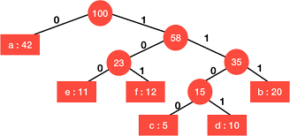
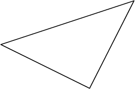

## Portfolio

---

### Double Linked List 

<!--[Double Linked List](/sample_page)
<!--  -->

 I created a template double linked list class from scratch. 

---

### Huffman Tree
<a href = "https://github.com/katiebug2001/CS_233/tree/master/HuffmanCodingStart/HuffmanCoding">
  <a/>
 Implemented huffman coding encryption algorithm. 
  
---
  
### Triangle Area
<a href="https://github.com/katiebug2001/CS_260/blob/master/HonsingerP4.s">
  <a/>
 Assembly program that calculates the area of a triangle.
  
---

### NAND to Tetris
<a href="https://github.com/katiebug2001/nand_to_tetris/tree/master/projects">
  <a/>
 Programming course to build a functioning computer starting from a NAND gate
  
  
<!--
- [Project 1 Title](http://example.com/)
- [Project 2 Title](http://example.com/)
- [Project 3 Title](http://example.com/)
- [Project 4 Title](http://example.com/)
- [Project 5 Title](http://example.com/)
-->

---

---

Page template forked from <a href="https://github.com/evanca/quick-portfolio">evanca</a>

<!-- Remove above link if you don't want to attibute -->
