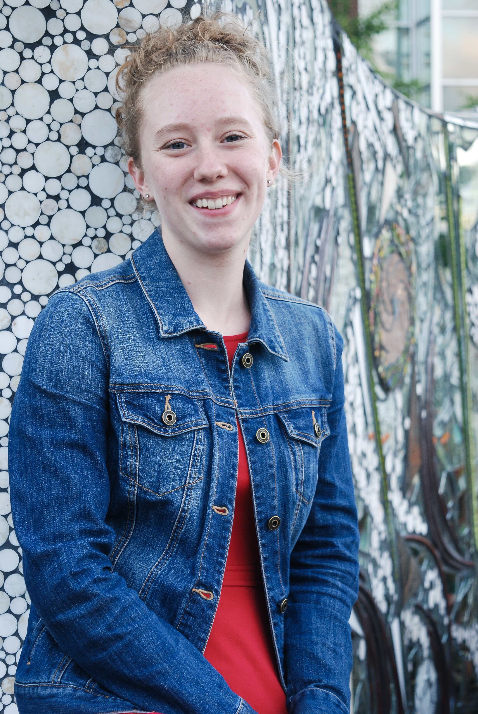
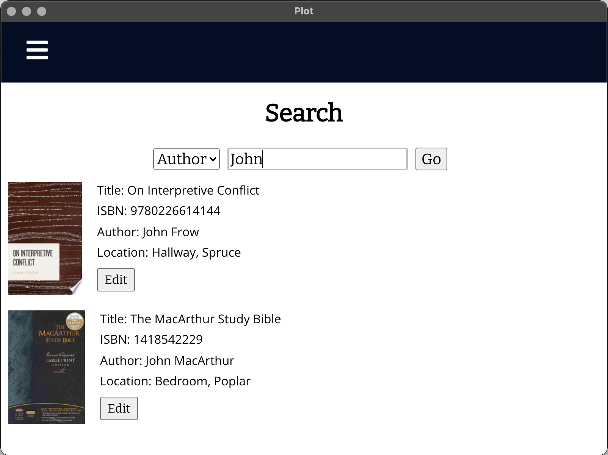
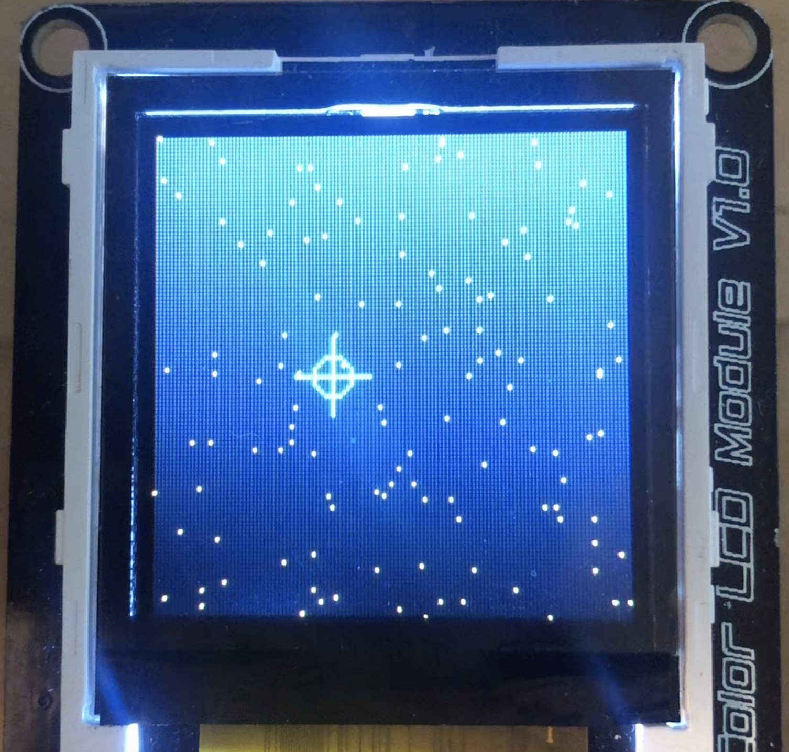

  

## I'm a Computer Science student at Seattle Pacific University.
In June, 2022 I will be graduating with a Bachelor of Science in Computer Science, a Bachelor of Arts in Honors Liberal Arts, and Minors in Math and Data Analytics.

Computer Science is my outlet to combine my gift for abstract, 
analytical thinking with my love of solving real-world problems for real-world people.  

Take a look at my 
<a href="https://www.linkedin.com/in/katie-honsinger" style = "color:#E51746">LinkedIn profile</a> 
 or my 
<a href = "https://docs.google.com/document/d/1cVIBF1EbtwgrIiXsw_PVmi1fSVNHfQkdOwSudeZ0krA/edit?usp=sharing" style = "color:#E51746">Resume</a>
## Here are some of my  favorite projects!
_click an image to learn more_

---

---
### Avionics Internship

### PLOT Library Cataloging

### Microcontroller Starblasters
  
 
 ---

---

Page template forked from <a href="https://github.com/evanca/quick-portfolio" style = "color:#E51746">evanca</a>

<!-- Remove above link if you don't want to attibute -->
