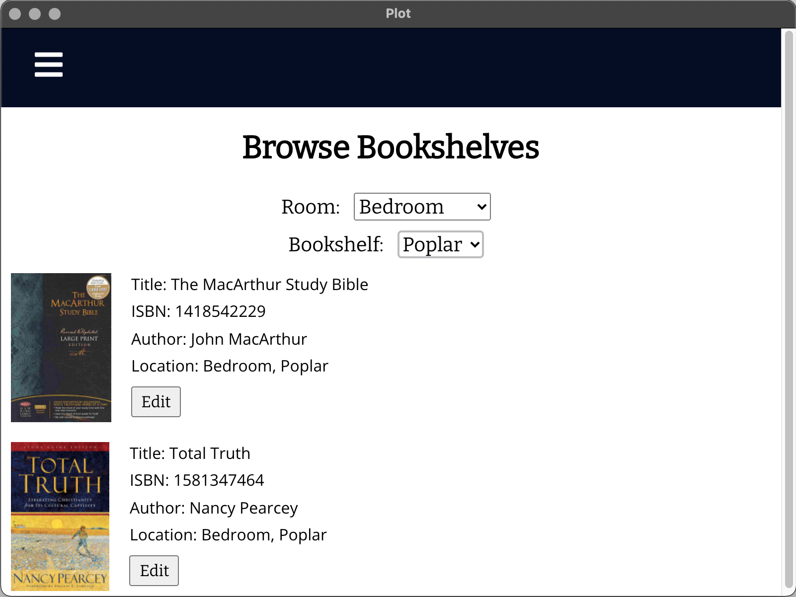

## Personal Library Tracking and Organization: PLOT
_Add books by ISBN, choose a shelf to store them on, and browse your library!_
  
I developed this project in several stages over multiple years. It began as a small personal project that I then developed a full design for in my Software Systems Design class. For my Software Capstone class, I developed the app alongside my team and acted as the lead developer. I polished the code as well as expanding and refining the functionality for my Honors Senior Project.

See a full product description and user manual, explore the code, or download the app at its [github repo](https://github.com/katiehons/plot2)  

<a href="https://katiebug2001.github.io/portfolio" style = "color:#E51746">Back Home</a> 
